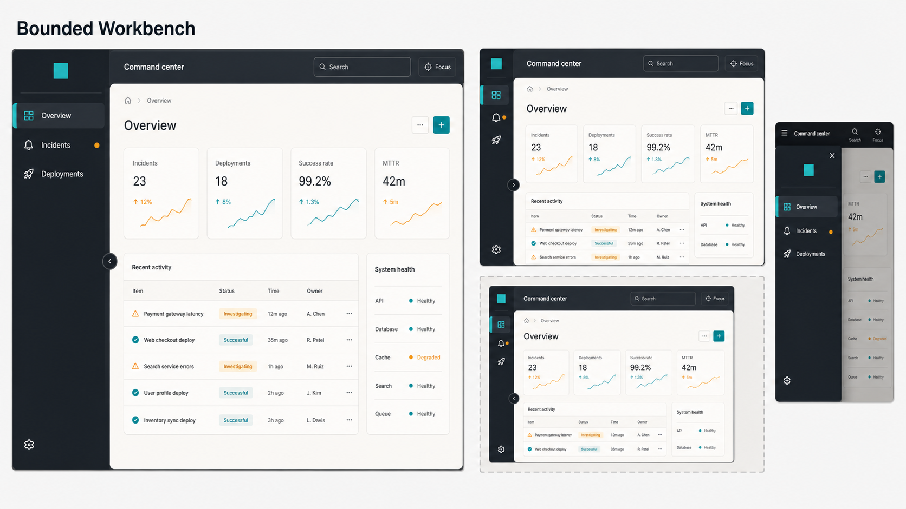

# SidebarShell Research

Status: Research draft for PRD review.

Research date: 10 July 2026.

## Product Boundary

SidebarShell is a P1 layout primitive that composes application chrome around
the existing Sidebar navigation family. It is not another navigation component
and it is not the later Dashboard Shell product block.

- Sidebar continues to own navigation semantics, current-route state, grouped
  items, compact rail behavior, and the mobile navigation drawer.
- SidebarShell owns the spatial relationship between navigation, topbar, main
  content, and optional footer; explicit scroll ownership; responsive shell
  posture; skip-link and landmark wiring; and opt-in collapsed-state
  persistence.
- Dashboard Shell remains a product block that chooses concrete breadcrumbs,
  command palette, notifications, account controls, page tools, and application
  recipes.

The source product PRD describes SidebarShell as a reusable app-shell pattern
with Sidebar, rail, topbar, content, mobile drawer, persisted collapse, a skip
link, and landmark roles. The existing Sidebar PRD deliberately leaves full
shell composition and local-storage persistence to a later app-shell layer.

## Comparative Research

| System                      | What it establishes                                                                                                                                                            | Gap Dethink should use                                                                                                                                                                         |
| --------------------------- | ------------------------------------------------------------------------------------------------------------------------------------------------------------------------------ | ---------------------------------------------------------------------------------------------------------------------------------------------------------------------------------------------- |
| Mantine AppShell            | Header, navbar, aside, footer, main offsets, breakpoint configuration, and separate desktop/mobile collapsed state.                                                            | Geometry is strong, but the pattern is primarily viewport and configuration driven. Dethink can make the shell container-aware and expose scroll ownership explicitly.                         |
| MUI Toolpad DashboardLayout | Ready-made full-screen header/sidebar, router-aware navigation, branding, account, theme switching, and replaceable slots.                                                     | It is an opinionated dashboard framework. Dethink should remain router-neutral, open-code, and compositional rather than owning navigation data or application services.                       |
| PatternFly Page             | Masthead, toggle, sidebar bodies, page sections, and managed or controlled sidebar visibility.                                                                                 | It provides enterprise page anatomy but is tied to PatternFly's visual/application model. Dethink can preserve a smaller primitive boundary and token-first styling.                           |
| Carbon UI Shell             | Fixed header, side navigation, hamburger handoff, skip-to-content, and strong product-wide brand consistency.                                                                  | Carbon's shell is intentionally prescriptive. Dethink should make the visual relationship distinctive without hard-coding branding or one global product structure.                            |
| Cloudscape AppLayout        | Collapsible navigation, tools, drawers, split panel, notifications, breadcrumbs, controlled states, and page-specific content behavior.                                        | It is powerful but broad. Dethink SidebarShell should avoid absorbing inspectors, tools panels, notifications, or page templates that belong to Drawer, Splitter, or Dashboard Shell.          |
| Primer PageLayout           | Semantic header/main/pane/footer regions, sticky and resizable sidebars, optional local-storage width persistence, narrow fullscreen behavior, and detailed landmark guidance. | It is the closest layout analogue but is a generic page-region system. Dethink can differentiate through first-class integration with Sidebar postures and a contained application-shell mode. |

## Research Conclusions

Common library patterns already cover a fixed or sticky header, a collapsible
side navigation, main-content offsets, and a mobile overlay. Repeating only
those features would add little beyond `SidebarProvider` plus custom flex/grid
classes.

The useful opening is a **bounded application shell**:

1. It works as a full viewport shell or inside a parent work area, split pane,
   preview, embedded product, or Storybook frame.
2. Its responsive posture follows the shell's own available inline size by
   default instead of assuming that the browser viewport is the only boundary.
3. It makes document-scroll versus internal-content-scroll behavior explicit,
   including sticky topbar behavior and overscroll containment.
4. It composes the existing Sidebar family and does not introduce a second
   navigation model.
5. It offers opt-in persistence with controlled-state escape hatches and an SSR
   strategy that prevents animated or unexplained first-paint jumps.
6. It renders a predictable semantic region map with one main landmark,
   labelled auxiliary regions where needed, and a focus-visible skip link.

## Visual Direction: Bounded Workbench

The visual signature is an L-shaped **workspace spine**:

- The navigation surface forms the vertical spine.
- A compact brand cap occupies the top of the spine.
- The contextual command deck begins over the work stage instead of blindly
  spanning across the navigation.
- Main content sits on a calm inset work stage with restrained depth and clear
  separation from persistent chrome.
- The collapse control lives at the navigation/work-stage seam and reuses the
  existing Sidebar rail interaction.
- Expanded, compact, contained, and mobile postures remain recognizably the
  same shell.
- The command deck, work stage, seam controls, and optional footer use
  coordinated Motion springs so the chrome feels responsive without becoming
  theatrical.
- Hover, tap, and focus micro-interactions reinforce affordance through small
  transform, opacity, and elevation changes; animation is never the only state
  signal.

This direction is structural rather than brand-specific. All colors, radii,
spacing, border, shadow, density, and motion values must remain token backed.
The mockup is reference material, not a raster implementation asset.

## Proposed V1 Contract

### Public anatomy

- `SidebarShell`
- `SidebarShellNavigation`
- `SidebarShellHeader`
- `SidebarShellMain`
- `SidebarShellFooter`
- `SidebarShellSkipLink`
- Optional exported state/type helpers when they improve controlled usage and
  persistence integration

Sidebar, SidebarRail, SidebarMobile, and SidebarMobileTrigger remain imports
from the existing Sidebar family rather than being renamed or duplicated.

### Layout postures

- `viewport`: fills the dynamic viewport and may own the content scroller.
- `contained`: fills its parent and responds to the shell container's size.
- Expanded and compact navigation reuse Sidebar collapsed state.
- Narrow mode composes the existing mobile drawer behavior.
- Left and right navigation placement and RTL remain supported.

### Scroll contract

- `content`: shell chrome remains stable while the main region owns scrolling.
- `document`: the document remains the scroller and sticky behavior is opt-in.
- Scrollbars, focus rings, anchored content, and skip-link targets must not be
  obscured by sticky regions.
- Viewport mode uses dynamic viewport units and safe-area-aware padding where
  the shell touches device edges.

### Persistence contract

- Persistence is opt-in and limited to the desktop expanded/compact preference.
- Controlled collapsed state always takes precedence over built-in persistence.
- Consumers can provide the initial state for server rendering.
- Storage failure, unavailable storage, and invalid stored values fall back to
  the declared default without breaking rendering.
- Restoring state must not run collapse motion on first paint.
- Mobile drawer open state is never persisted.

### Responsive contract

- Container-aware behavior is the default differentiator for contained shells.
- A viewport-responsive mode remains available for conventional full-page apps.
- A manual mode allows applications to own the responsive handoff.
- Responsive changes preserve logical DOM order and do not leave duplicate
  visible navigation landmarks or focusable hidden content.

### Accessibility contract

- Provide a skip link before repeated shell navigation.
- Render exactly one main landmark by default.
- Use native header, main, aside/nav, and footer semantics where appropriate.
- Require labels when multiple landmarks of the same type would otherwise be
  ambiguous.
- Keep focus visible and unobscured by sticky chrome.
- Reuse SidebarMobile focus containment, Escape dismissal, and focus return.
- Remain usable at 320 CSS pixels and 200% zoom without horizontal page scroll.

## Differentiation Guardrails

- Do not add a router, navigation schema, auth/session provider, account menu,
  theme switcher, notifications system, or command service.
- Do not duplicate Sidebar item, group, current-route, rail, or mobile-drawer
  APIs.
- Do not absorb Cloudscape-style tools panels, drawers, split panels, or page
  content types; compose the existing Drawer and future Splitter instead.
- Do not make local storage mandatory or silently persist mobile state.
- Use `motion/react` for every SidebarShell animation primitive. Keep static
  state styling in Tailwind, but do not create a parallel CSS-transition
  choreography for the shell.
- Use shared Motion variants and `MotionConfig` for named motion presets. Keep
  layout animation scoped to shell regions and use transform/opacity-first
  micro-interactions.
- Resolve non-essential movement to immediate state changes when the provider
  disables animation or `useReducedMotion` reports a user preference.
- Do not rely on viewport media queries alone for contained mode.
- Do not hard-code the graphite/teal reference palette from the mockup.

## Testing Seams Proposed For The PRD

- Rendered public behavior for anatomy, semantic element selection, class/data
  attributes, refs, controlled/uncontrolled collapsed state, and Sidebar
  composition.
- Persistence behavior across remount, precedence of controlled state, invalid
  and unavailable storage, SSR initial state, and no first-paint collapse
  animation.
- Container-responsive posture through the existing mocked `ResizeObserver`
  seam used by HorizontalAccordion, plus viewport and manual modes.
- Scroll-mode behavior, sticky header offsets, focus visibility, overscroll
  containment, dynamic viewport sizing, and safe-area class coverage.
- Mobile drawer open/close, Escape, outside dismissal, route-action close where
  composed, focus entry, and focus return through existing Sidebar seams.
- Accessibility automation for expanded, compact, contained, viewport, mobile,
  left/right, RTL, dark mode, and density states; explicit landmark and skip-link
  assertions.
- SSR and hydration smoke for viewport/contained modes and persisted defaults.
- Storybook interaction coverage for collapse, remount persistence, container
  resize, mobile handoff, scroll modes, and reduced motion.
- Visual state coverage for the Bounded Workbench and plain treatments across
  expanded, compact, contained, mobile, light/dark, density, RTL, and long
  content states.
- Registry validation, clean registry-install smoke, package build/typecheck,
  Storybook build, and Vite consumer smoke.

## Primary Sources

- [Mantine AppShell source documentation](https://github.com/mantinedev/mantine/blob/9.0.0/apps/mantine.dev/src/pages/core/app-shell.mdx)
- [MUI Toolpad Dashboard Layout](https://mui.com/toolpad/core/react-dashboard-layout/)
- [PatternFly Page](https://www.patternfly.org/components/page/)
- [Carbon UI Shell](https://carbondesignsystem.com/components/UI-shell-header/usage/)
- [Cloudscape App Layout](https://cloudscape.design/components/app-layout/)
- [Primer PageLayout](https://primer.style/product/components/page-layout/)
- [Primer PageLayout accessibility](https://primer.style/product/components/page-layout/accessibility/)
- [Motion for React](https://motion.dev/docs/react)
- Modern Web Guidance: modern CSS architecture and size-aware styling guides,
  retrieved 10 July 2026.
