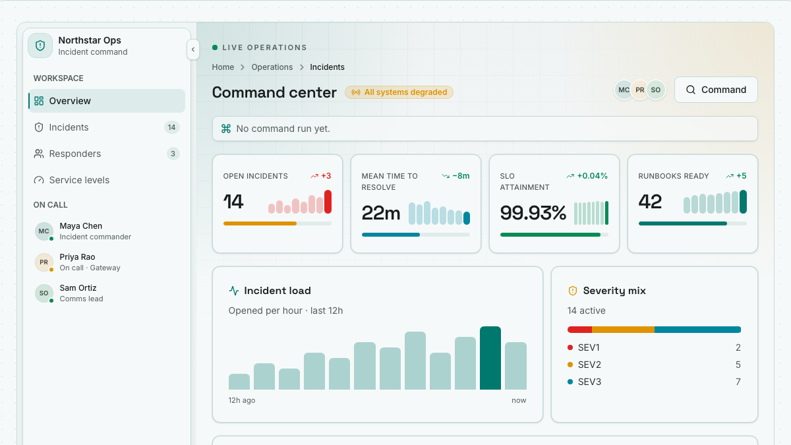
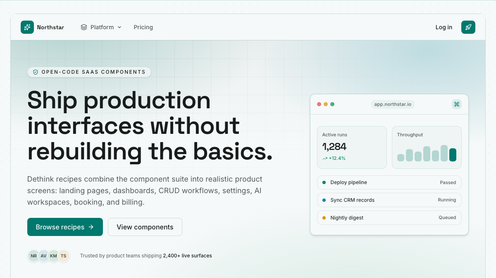
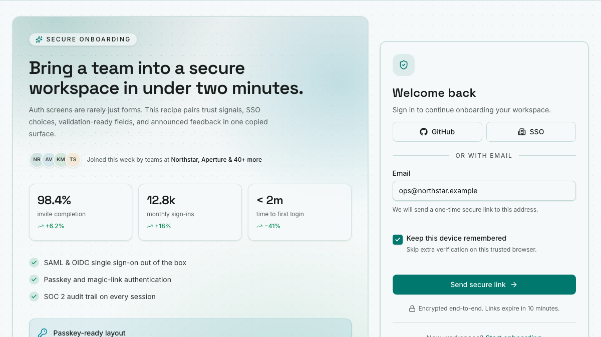

# Recipe Capture Review — Approved

The representative set follows [the deterministic capture contract](./recipe-capture-contract.md). Review the crop, legibility, consistency, and usefulness at gallery-card scale before the treatment is applied to all ten recipes.

## Dashboard-like

## Marketing

## Form-oriented

Status: approved by the user on 10 July 2026. The same deterministic treatment was applied to all ten recipe surfaces and integrated into the recipe gallery.

The final set is stored in `apps/showcase/public/recipe-captures/`. Every image is 1200×675, uses the teal/light/default-density presentation, and keeps the top of the live recipe surface aligned in the crop.
