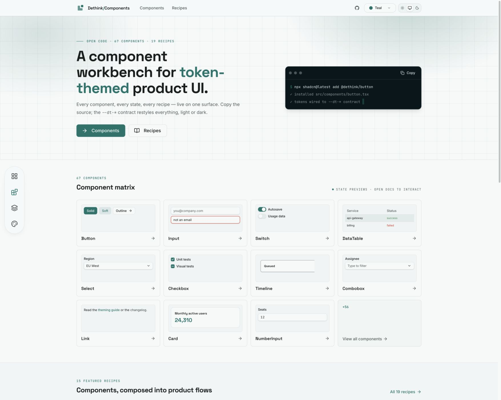
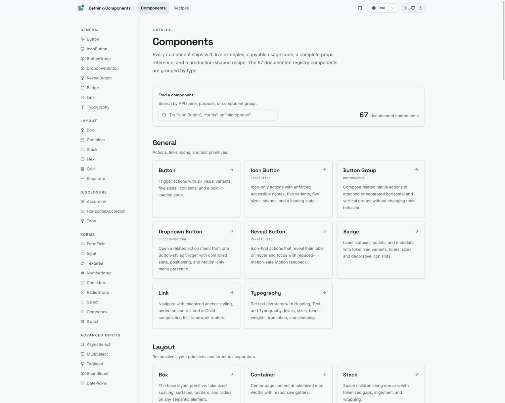
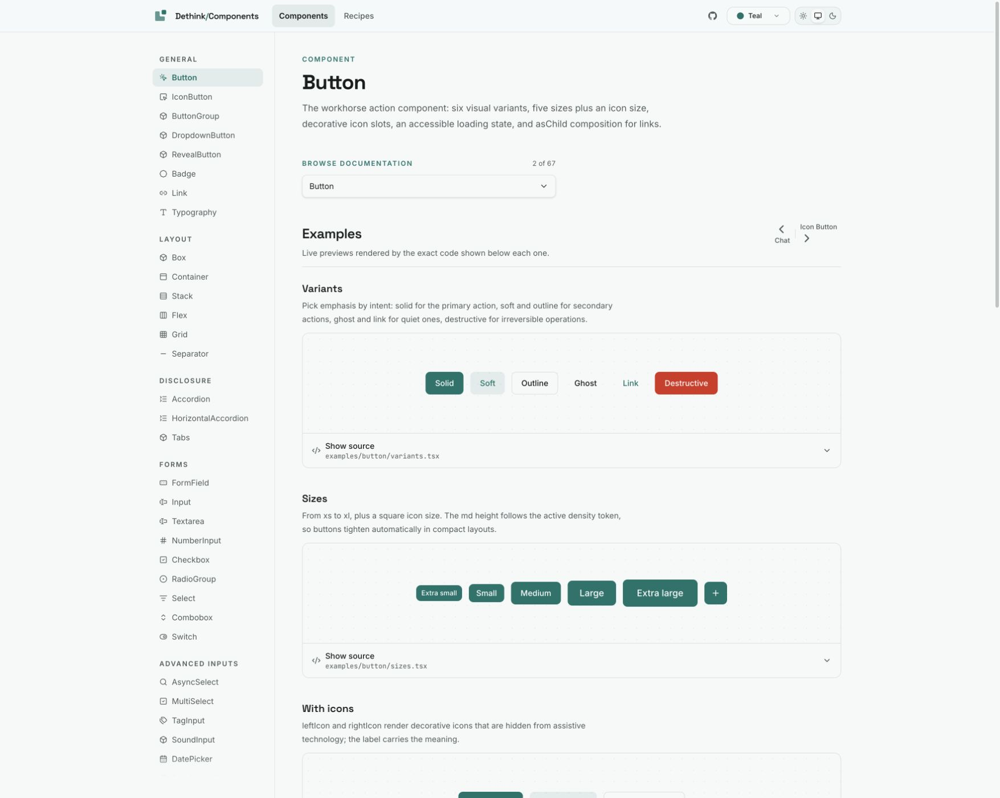
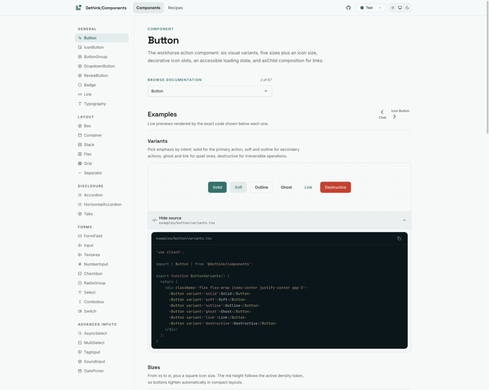
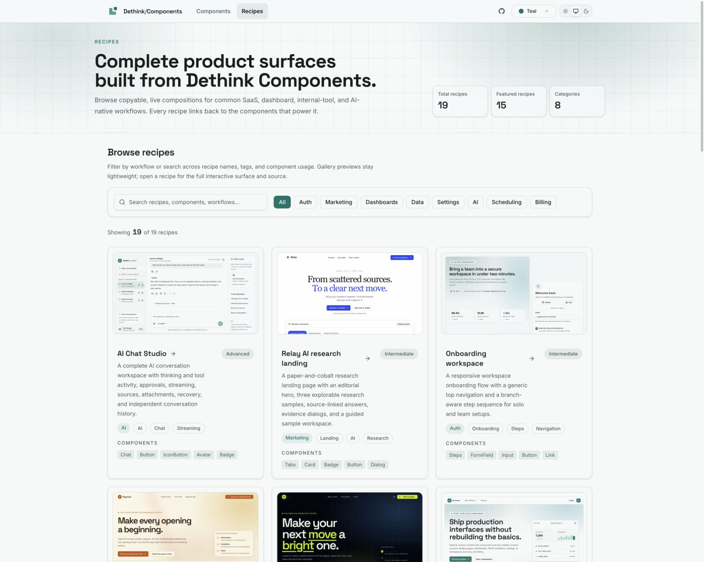
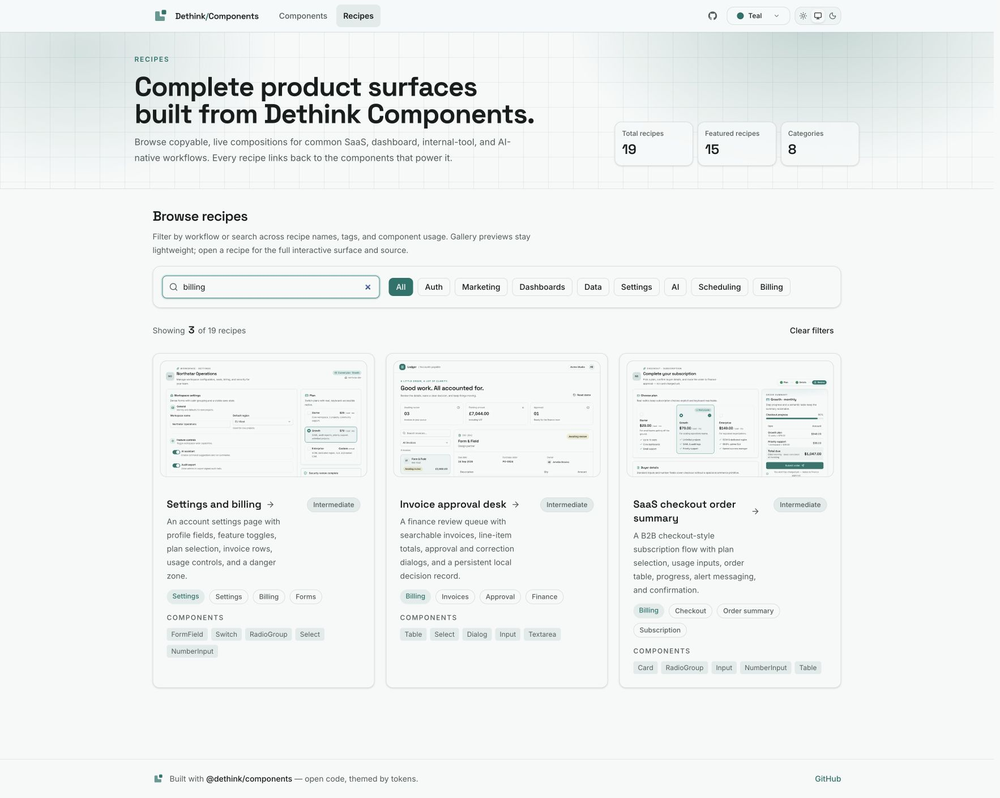
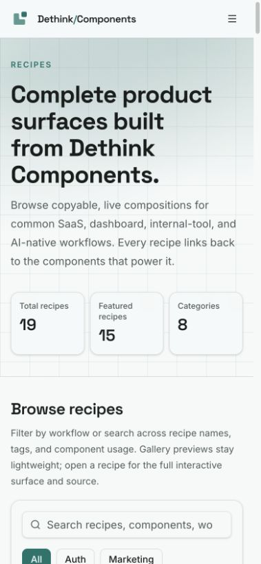

# Dethink showcase: current experience audit

Captured from the production site on 2026-09-19 using the in-app browser. This is a focused design review supporting the overhaul concepts, not a full functional or accessibility audit. Screenshots show the actual observed states; the proposals are in [plan.md](plan.md).

## 1. Homepage — useful content, technical introduction

The site has a clear identity and a useful preview matrix. The first message emphasizes tokens and a terminal instead of the visitor's task. An icon dock repeats destinations already served by the main navigation. The caption correctly explains that matrix previews are not interactive; preserve that clarity when making previews more prominent.

## 2. Component catalog — navigable, visually repetitive

Categories and a labelled search field are present. The full catalog switches from visual previews to lengthy text cards, alongside a second long inventory in the sidebar. This makes visual recognition and comparison harder. The small API-name labels and long prose deserve a readability check, rather than an unsupported contrast-failure claim.

## 3. Button details — useful demonstrations, repeated navigation

Real examples are a strength. The sidebar, component switcher, ordinal counter, and previous/next links all compete above the first useful example. Installation follows the long examples section in the page structure. A more direct header-to-example-to-install path would help a developer trying to adopt one component.

## 4. Source disclosure — works, adds page length

Opening “Show source” reveals the actual usage code and a copy button. This action was verified. The source appears below the preview and pushes later examples down; a compact default snippet and an explicit full-source disclosure could preserve context. Copy behavior and screen-reader announcements were not exhaustively tested in this audit.

## 5. Recipe gallery — good screenshots, too much competing metadata

Real interface captures communicate the product well. The tall introduction, three counters, repeated browse introduction, long summaries, complexity labels, tags, and component chips make a single entry expensive to scan. Present the screenshot, purpose, and demo action first. Move supporting technical detail to the recipe page.

## 6. Recipe search — useful existing behavior

Searching “billing” returns three relevant recipes and exposes Clear filters. Clearing restores the catalog. This is a good behavior to preserve and extend across components and guides. This audit did not test typo tolerance, every synonym, or browser-history persistence.

## 7. Mobile recipe entry — usable reflow, delayed discovery

At 390×844, the introduction, counts, and browse explanation fill most of the screen. Search is near the bottom and no recipe preview is visible. Shortening the introduction and moving counts out of the main reading path would bring the useful content forward. The header collapses to a menu; full mobile menu keyboard/focus behavior was outside this pass.

## Limits and preservation priorities

Preserve working source disclosure, labelled search, relevant recipe results, actual recipe captures, theme support, and existing deep links. Do not infer user frustration rates, performance scores, or accessibility compliance from this visual review. Follow-up acceptance work needs keyboard and screen-reader testing, contrast checks in both themes, representative complex examples, performance measurements, and a small usability study.

Local source inspection additionally confirmed that homepage recipe previews currently use category text instead of the maintained screenshots already used by the gallery. This finding is from code inspection, not the above-fold homepage screenshot.
