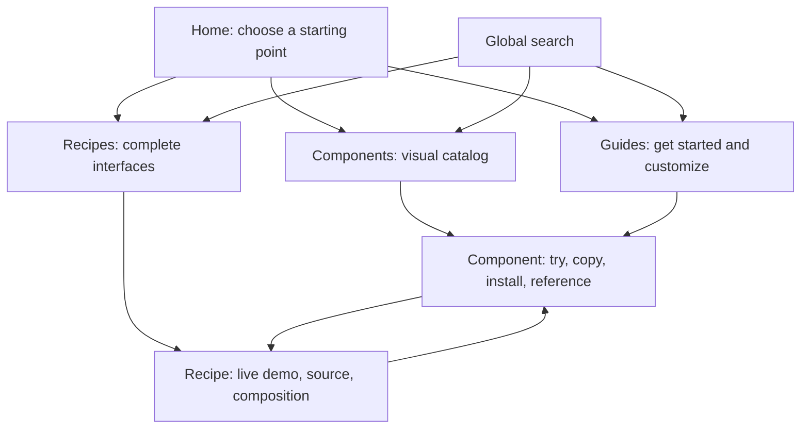

# Dethink showcase overhaul — concept plan

Date: 2026-09-19. Status: design exploration; awaiting a chosen direction. No implementation, deployment, or approved feature scope is implied by these mockups.

## Recommendation

Make the site a visual library with one clear journey: **find → try → copy**. Use Atlas as the default browsing structure, Showroom's treatment of complete recipes, and Workbench's focused component detail experience. These can be complementary parts of one site, rather than three incompatible brands.

Primary audience: developers choosing and adopting React UI components. Secondary audience: designers and builders evaluating how those components compose into real interfaces. New visitors need orientation; returning developers need a fast route to a known component.

Keep the Dethink identity, open-code positioning, teal accent, existing components, recipes, and canonical URLs. Improve hierarchy, discovery, and the connection between examples and usable source.

## What exists today

The live site currently exposes 67 components and 19 recipes. The homepage has a component matrix, recipes, and a foundations section. Component pages have working previews, source disclosure, installation, and props. The recipe gallery already has real captures and useful search/category filtering.

The audit covered the homepage, component catalog, Button detail, source disclosure, recipe gallery, a billing search, and the mobile recipe entry screen. [Full audit and screenshots](audit.md).

| Observed friction | Proposed change |
| --- | --- |
| The homepage leads with token terminology and a terminal; the visual examples arrive later. | Lead with what visitors can find and build, followed immediately by real examples. Move detailed token education into Guides. |
| The homepage matrix is visual, but the full component catalog uses long descriptions without previews. | Use the same recognizable visual tiles across home and catalog, with a compact list alternative for quick scanning. |
| Component docs repeat a long sidebar, component switcher, count, and previous/next controls. | One searchable component navigation, plus local page navigation for Examples, Installation, API, and Accessibility. |
| Preview and source are available, but installation is below a long sequence of examples. | Put a useful initial preview, copy action, and install entry near the page title; retain detailed examples below. |
| The recipe gallery has good screenshots but long descriptions, many tags, and large counters above them. | Shorten the introduction and captions, prioritize captures, and reveal technical composition on demand. |
| At 390×844, the recipe introduction and counts fill most of the initial viewport; no recipe is visible. | Make search and the first useful preview visible sooner. Use one compact intro and a filter sheet on mobile. |
| Home recipe previews use category text while the gallery uses real screenshots (confirmed in source). | Reuse maintained captures consistently in both places. |

These are design findings, not measured conversion failures. This pass did not conduct a full accessibility audit, analytics study, or usability test.

## The three concepts

Displayed generation order is authoritative: 1 Atlas, 2 Showroom, 3 Workbench.

| Concept | Main question it answers | Main screen | Strength | Tradeoff |
| --- | --- | --- | --- | --- |
| **1 · Atlas** | “Where is the component I need?” | Searchable visual library with concise categories, preview tiles, and nearby recipes. | Best everyday entry point; supports both browsing and known-item lookup. | Can feel utilitarian unless the real previews have enough visual character. |
| **2 · Showroom** | “What can I build with this?” | Editorial recipe discovery with a featured interface and workflow choices. | Strongest first impression and easiest way to understand complete compositions. | Slower for someone looking for a specific primitive unless search and Components remain obvious. |
| **3 · Workbench** | “How does it behave, and how do I use it?” | Component preview, selected controls, states, usage source, and installation together. | Best adoption experience and clearest connection between behavior and code. | Most implementation effort; controls must be authored per component, not generated as an overwhelming property editor. |

- [Atlas mockup](mockups/01-atlas.png)
- [Showroom mockup](mockups/02-showroom.png)
- [Workbench mockup](mockups/03-workbench.png)

Mockups are raster design references, not working UI. Generated code snippets, miniature recipe screens, invented incidental copy, and subtle gradients are illustrative and are not implementation requirements. Use real recipe captures and exact verified component source in the eventual product. Atlas currently repeats search in its header and main area: consolidate to one clear search entry in a refinement. Workbench's persistent dark rail is a visual option, not a requirement for mixed-theme chrome.

## Proposed site map and journeys

Top navigation: **Components · Recipes · Guides**, a single global search entry, GitHub, and clearly labelled appearance controls. Home is reachable through the brand. Keep “Recipes” with the plain-language description “Complete interfaces”; do not introduce a separate competing “Showcase” section with the same content.

Global search should group matches into Components, Recipes, and Guides. Support human-readable names and aliases such as “date range”, “popup”, “chat”, and “billing”. Explicitly label result types, show useful empty states, and support keyboard navigation. Preserve the query and selected category in the URL so browser Back and shared links behave predictably.

### Home

- One clear promise: “Open-code components and complete interfaces.”
- Two obvious starting points: “Browse components” and “Explore recipes”.
- A compact selection of recognizable component previews and real recipe screenshots.
- A visible Getting started link. Keep installation context here concise; explain prerequisites and complete setup in Guides.
- Remove the floating section dock and avoid duplicating site navigation inside the page.

### Component catalog

- Human names first: “Icon Button”, “Date Range Picker”, “Data Table”. API names remain searchable and appear on detail pages.
- Compact categories and visual previews; descriptions are one sentence at most.
- Preview tiles navigate to details. Make previews visibly illustrative; do not nest misleading interactive controls in a linked card.
- Place effects in an identifiable category so decorative backgrounds do not obscure core controls.

### Component detail

- Title, short purpose, installation entry, and a useful example immediately visible.
- An authored playground for components that benefit from controls; do not force a property panel onto every primitive.
- Keep a few meaningful controls, Reset, visible state labels, and exact usage code. Changes to controls must update the corresponding snippet.
- Local sections: Examples, Installation, API, Accessibility. “Playground” can be the lead example, not an additional competing destination.
- On mobile stack preview → controls → code; let only the code region scroll horizontally.
- Clearly distinguish registry installation, package imports, and any companion CSS/setup. Copying an example must not hide dependencies.
- Link to genuine recipes that use the component, derived from the existing composition metadata.

### Recipes

- Browse by user goals such as building a landing page, an AI interface, or a settings flow. Preserve existing categories internally where practical.
- Use large actual captures, a short title, one sentence, and a clear “Open demo” action. Move complexity and full component lists into details.
- Recipe detail retains its full-page demo and a restrained persistent bar with Back, Source, and Components used.
- Component links should work in both directions; do not imply that a whole recipe is a registry-installable block when it is not.
- Preserve query/filter/scroll state when returning to the gallery.

### Guides and responsive behavior

- Getting started, installation, themes, accessibility, and contribution guidance get a clear home.
- Keep global search reachable on mobile; navigation and category filters use separate labelled controls.
- Respect light/dark mode and reduced motion. Use explicit labels, visible focus, sufficient contrast, generous hit targets, and consistent inset spacing.
- Use static lightweight catalog previews and load interactive examples when needed. No autoplay in every tile.

## Delivery sequence after design approval

1. **Refine the selected direction.** Produce a coherent home/catalog, component page, and recipe gallery specification, including mobile and dark states. Resolve search placement, navigation labels, and the relationship between the three concepts.
2. **Create the GitHub PRD and implementation issues.** Follow the repository's required planning workflow. No production work starts until the PRD and approved issue slices exist.
3. **Ship the navigation and discovery slice.** Shared header, search, category navigation, URL state, home, and component catalog; preserve existing routes.
4. **Ship a representative component journey.** Button first, then a form control and Data Table/Chat to prove the detail design handles simple and complex examples before applying it across the catalog.
5. **Ship the recipe journey.** Real home captures, simplified gallery, demo/source/composition links, and return-state preservation.
6. **Complete guidance and acceptance.** First-use setup, mobile/dark states, keyboard paths, accessibility checks, performance checks, source accuracy, and route/link coverage.

## Acceptance targets

These are proposed targets, not current measured results.

- A first-time visitor can explain the difference between a component and a recipe from the entry screen.
- From any top-level page, search is reachable in one action and a known component in no more than two actions after entering a query.
- At 390×844, the primary discovery control and the start of useful preview content appear without a full screen of introductory material.
- Preview → code → installation is clear on representative components; copying code gives feedback and preserves context.
- Every recipe-to-component and component-to-recipe link resolves correctly.
- Back restores relevant search/filter state; meaningful states have shareable URLs.
- Keyboard-only users can search, open examples, operate controls, copy source, and return without losing focus.
- Validate with five representative users on “find a searchable select”, “find a billing page”, and “change a Button and take its code”; target at least four completing each task without guidance. Record a baseline first.

## Scope limits

This is an overhaul of the public showcase and documentation experience. It does not redesign the public component APIs, replace working recipes, introduce accounts, create a visual page builder, or add an AI assistant. Those would be separate product decisions.

Audit captures, concept prompts, and mockups are saved alongside this plan. No application source was changed in this planning pass.
